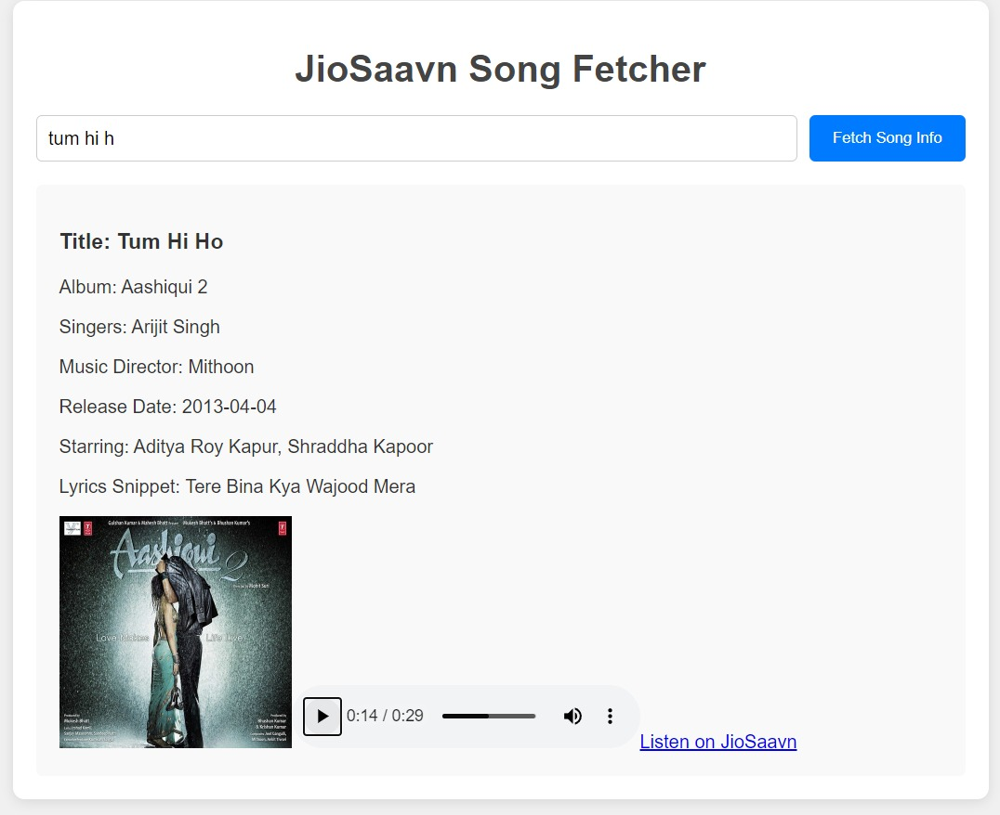

# 🎵 JioSaavn Flask App

This Flask application provides a simple API interface for fetching songs, albums, and playlists from [JioSaavn](https://www.jiosaavn.com/) using the [JioSaavnAPI](https://cyberboysumanjay.github.io/JioSaavnAPI/).

## Features
- Fetch song details by name
- Retrieve album and playlist data
- Connects to JIOSavan App
- Lightweight Dockerized Flask app

## 🛠️Tech Stack
- 📀 *Flask*: Python micro web framework.
- 📀 *JioSaavnAPI*: An unofficial API to interact with JioSaavn.
- 📀 *Docker*: Containerized deployment.

## Preview



## Installation and Usage

### 1. Clone the Repository
🔗bash
🔗git clone https://github.com/kavyanshisrivastava2/Flask-jiosaavn-app.git
🔗cd jiosavan-flask

*Prerequisites For Docker image:*
- Docker installed on your machine.

### 2.Running the App Locally
1. 🐳Pull the Docker image from DockerHub:
```bash
docker pull kavyanshi/jio-flask:latest


